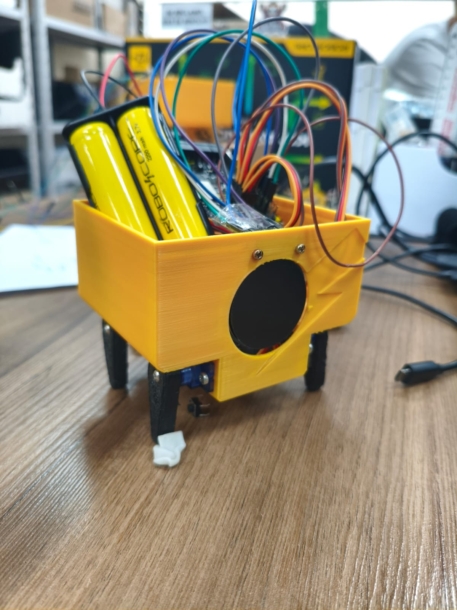

# 🐶 DogLike Otto Robot + GC9A01 Display

A fun and educational project to build a **quadruped robot inspired by Otto DIY**, but with a **dog-like personality** (**DogLike Otto Robot**), using the **RoboCore Vespa**, powered by **two 3.7V batteries**, and equipped with a **round GC9A01 display** to show emotions while the robot interacts.  

It combines **PID-controlled servo motors**, **walking gaits**, **facial expressions on the display**, and **simple movements** to create a highly engaging experience.

---

## 🐾 Features  

- 🚶 **Walk forward** with smooth motion using PID control on the legs  
- 🪑 **Sit** (stable 4-leg movement)  
- ✋ **Give a paw** (raise the front-right leg and return to position)  
- 🛏 **Lie down** (gradual relaxation of the legs)  
- 😀 **Display emotions** on the GC9A01 (blinking eyes and happy expressions)

> 💡 **Highlight:** PID ensures legs move smoothly and reach the desired angles without jerks, even with variations in load or friction.

---

## 📷 Overview  

The result is a robot that seems **alive**, reacting with expressions while performing actions.

---

## 🔧 Required Components  

| Component | Qty | Notes |
|-----------|-----|-------|
| [RoboCore Vespa](https://www.robocore.net/) | 1 | Controller board |
| Micro servo 9g | 4 | For the legs |
| GC9A01 1.28" Display | 1 | SPI interface |
| 18650 Battery 3.7V | 2 | Power supply |
| 2×18650 Holder | 1 | With wires or JST connector |
| M2 Screws + Nuts | 2 each | For fixing the display |
| TPU Feet | 4 | Better grip on floor |
| Servo Screws | — | Usually come with the servos |
| USB Cable | 1 | For programming |

---

## 🖥 Connections  

### 📺 GC9A01 Display → Vespa  

| Vespa | GC9A01 |
|------|--------|
| 5 (SPI CS) | CS |
| 17 (DC) | DC |
| 16 (RST) | RST |
| 22 (SCK) | SCL |
| 21 (MOSI) | SDA |
| 3.3V | VCC |
| GND | GND |

### ⚙️ Servos → Vespa  

| Vespa | Servo |
|------|-------|
| D0 | Servo 1 (Front Left) |
| D1 | Servo 2 (Front Right) |
| D2 | Servo 3 (Rear Left) |
| D3 | Servo 4 (Rear Right) |
| 5V | Common VCC |
| GND | Common GND |

> 💡 **Tip:** Use a separate power line for servos if they draw too much current — prevents Vespa from resetting during movement.

---

## ⚙️ PID-Controlled Legs  

Each servo angle is corrected using a **simple PID**:  
- **Kp** adjusts the force to reach the desired angle  
- **Kd** smooths the movement, avoiding overshoot  
- Ensures **fluid walking**, no jerks, stable response

---

## 🛠 Assembly  

- 🔩 **Servos:** attach each with screws provided in the kit  
- 🐾 **Feet:** attach or screw onto servo horns for better traction  
- 📺 **Display:** fix the GC9A01 with **M2 screws + nuts** on a 3D mount  
- 🔋 **Batteries:** use two 18650 in series (~7.4V). Vespa regulates voltage for itself and the display

---

## 📂 3D Files  

| Part | STL File |
|------|----------|
| TPU Feet | [`stl/pata_tpu.stl`](stl/pata_tpu.stl) |
| Display Mount | [`stl/suporte_display.stl`](stl/suporte_display.stl) |

> 📌 Click the link to download files and print in TPU or PLA  

---

## 🚀 Next Steps  

- [ ] Add wiring diagram (`media/wiring.png`)  
- [ ] Publish code with basic gaits  
- [ ] Create a set of faces for the display  
- [ ] Document fine PID tuning for different servos  

---

## 📜 License  

This project is licensed under the [MIT License](LICENSE).  
Feel free to use, modify, and share!  

---

💡 **Turn this project into your own DogLike Otto and share it on LinkedIn and GitHub!**  

  
